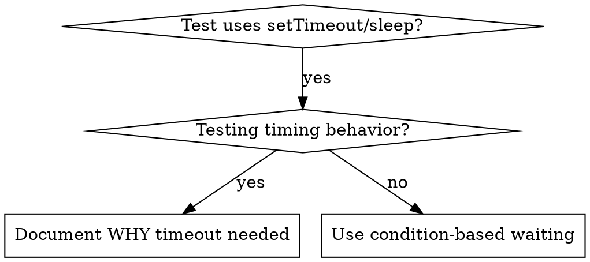

# Condition-Based Waiting

## Overview

Flaky tests 常用 arbitrary delays 猜 timing。这制造 race conditions：fast machines 上 pass，load 或 CI 下 fail。

**Core principle：** Wait for 你真正关心的 actual condition，不是猜需要多久。

## When to Use



**Use when：**
- Tests 有 arbitrary delays（`setTimeout`、`sleep`、`time.sleep()`）
- Tests flaky（有时 pass，load 下 fail）
- Parallel 运行时 timeout
- 等待 async operations 完成

**Don't use when：**
- 测试 actual timing behavior（debounce、throttle intervals）
- 若用 arbitrary timeout，ALWAYS document WHY

## Core Pattern

```typescript
// ❌ BEFORE: Guessing at timing
await new Promise(r => setTimeout(r, 50));
const result = getResult();
expect(result).toBeDefined();

// ✅ AFTER: Waiting for condition
await waitFor(() => getResult() !== undefined);
const result = getResult();
expect(result).toBeDefined();
```

## Quick Patterns

| Scenario | Pattern |
|----------|---------|
| Wait for event | `waitFor(() => events.find(e => e.type === 'DONE'))` |
| Wait for state | `waitFor(() => machine.state === 'ready')` |
| Wait for count | `waitFor(() => items.length >= 5)` |
| Wait for file | `waitFor(() => fs.existsSync(path))` |
| Complex condition | `waitFor(() => obj.ready && obj.value > 10)` |

## Implementation

Generic polling function:
```typescript
async function waitFor<T>(
  condition: () => T | undefined | null | false,
  description: string,
  timeoutMs = 5000
): Promise<T> {
  const startTime = Date.now();

  while (true) {
    const result = condition();
    if (result) return result;

    if (Date.now() - startTime > timeoutMs) {
      throw new Error(`Timeout waiting for ${description} after ${timeoutMs}ms`);
    }

    await new Promise(r => setTimeout(r, 10)); // Poll every 10ms
  }
}
```

完整实现及 domain-specific helpers（`waitForEvent`、`waitForEventCount`、`waitForEventMatch`）见本目录 `condition-based-waiting-example.ts`，来自 actual debugging session。

## Common Mistakes

**❌ Polling too fast:** `setTimeout(check, 1)` — wastes CPU
**✅ Fix:** Poll every 10ms

**❌ No timeout:** 条件永不满足则 loop forever
**✅ Fix:** Always include timeout with clear error

**❌ Stale data:** Loop 前 cache state
**✅ Fix:** Loop 内 call getter 取 fresh data

## When Arbitrary Timeout IS Correct

```typescript
// Tool ticks every 100ms - need 2 ticks to verify partial output
await waitForEvent(manager, 'TOOL_STARTED'); // First: wait for condition
await new Promise(r => setTimeout(r, 200));   // Then: wait for timed behavior
// 200ms = 2 ticks at 100ms intervals - documented and justified
```

**Requirements:**
1. First wait for triggering condition
2. Based on known timing（not guessing）
3. Comment explaining WHY

## Real-World Impact

来自 debugging session (2025-10-03)：
- 修复 3 个文件中 15 个 flaky tests
- Pass rate：60% → 100%
- Execution time：40% faster
- No more race conditions
