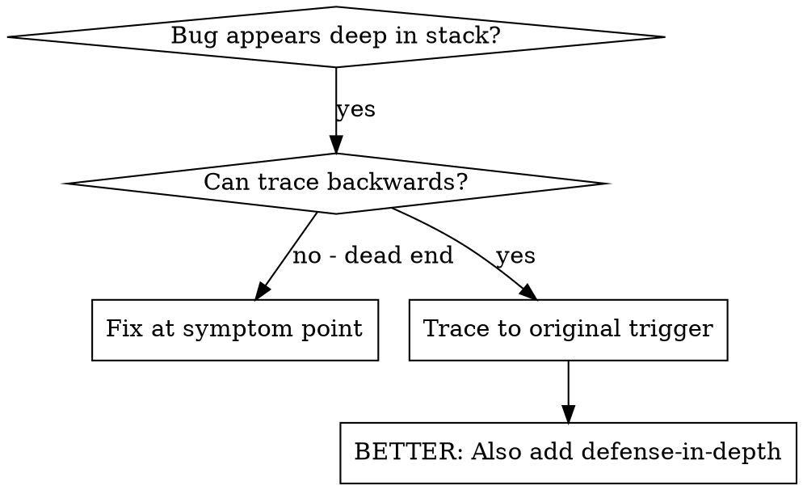
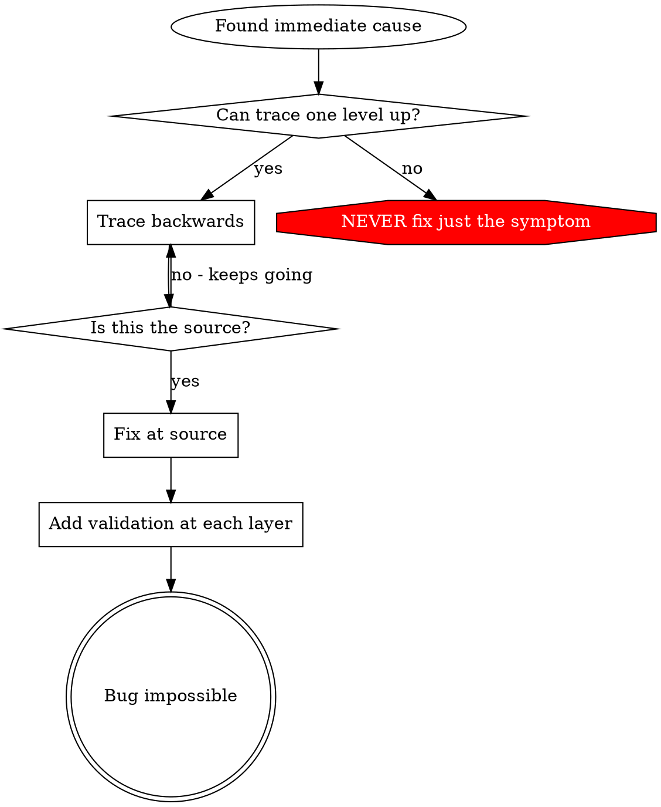

# Root Cause Tracing

## Overview

Bugs 常在 call stack 深处 manifest（git init 在 wrong directory、file 创建在 wrong location、database 用 wrong path 打开）。本能是在 error 出现处 fix，那是在 treat symptom。

**Core principle：** 沿 call chain 向后 trace 直到 original trigger，然后在 source 修复。

## When to Use



**Use when：**
- Error 在 execution 深处（非 entry point）
- Stack trace 显示 long call chain
- 不清楚 invalid data 从哪 originate
- 需找出哪个 test/code 触发 problem

## The Tracing Process

### 1. Observe the Symptom
```
Error: git init failed in ~/project/packages/core
```

### 2. Find Immediate Cause
**什么 code 直接造成 this？**
```typescript
await execFileAsync('git', ['init'], { cwd: projectDir });
```

### 3. Ask: What Called This?
```typescript
WorktreeManager.createSessionWorktree(projectDir, sessionId)
  → called by Session.initializeWorkspace()
  → called by Session.create()
  → called by test at Project.create()
```

### 4. Keep Tracing Up
**传了什么 value？**
- `projectDir = ''` (empty string!)
- Empty string 作为 `cwd` 会 resolve 到 `process.cwd()`
- 那就是 source code directory!

### 5. Find Original Trigger
**Empty string 从哪来？**
```typescript
const context = setupCoreTest(); // Returns { tempDir: '' }
Project.create('name', context.tempDir); // Accessed before beforeEach!
```

## Adding Stack Traces

无法手动 trace 时，添加 instrumentation：

```typescript
// Before the problematic operation
async function gitInit(directory: string) {
  const stack = new Error().stack;
  console.error('DEBUG git init:', {
    directory,
    cwd: process.cwd(),
    nodeEnv: process.env.NODE_ENV,
    stack,
  });

  await execFileAsync('git', ['init'], { cwd: directory });
}
```

**Critical：** 在 tests 中用 `console.error()`（不用 logger — 可能不显示）

**Run and capture:**
```bash
npm test 2>&1 | grep 'DEBUG git init'
```

**Analyze stack traces:**
- 找 test file names
- 找触发 call 的 line number
- 识别 pattern（同一 test？同一 parameter？）

## Finding Which Test Causes Pollution

若 tests 期间出现某物但不知哪个 test：

用本目录 bisection script `find-polluter.sh`：

```bash
./find-polluter.sh '.git' 'src/**/*.test.ts'
```

逐个运行 tests，在 first polluter 停止。用法见 script。

## Real Example: Empty projectDir

**Symptom：** `.git` 创建在 `packages/core/`（source code）

**Trace chain:**
1. `git init` 在 `process.cwd()` 运行 ← empty cwd parameter
2. WorktreeManager 以 empty projectDir 调用
3. Session.create() 传入 empty string
4. Test 在 beforeEach 前访问 `context.tempDir`
5. setupCoreTest() 初始返回 `{ tempDir: '' }`

**Root cause：** Top-level variable initialization 访问 empty value

**Fix：** 将 tempDir 改为 getter，beforeEach 前访问则 throw

**Also added defense-in-depth:**
- Layer 1: Project.create() validates directory
- Layer 2: WorkspaceManager validates not empty
- Layer 3: NODE_ENV guard refuses git init outside tmpdir
- Layer 4: Stack trace logging before git init

## Key Principle



**NEVER 只在 error 出现处 fix。** Trace back 找 original trigger。

## Stack Trace Tips

**In tests:** 用 `console.error()` 不用 logger — logger 可能被 suppress
**Before operation:** 在 dangerous operation 前 log，不是 fail 后
**Include context:** Directory、cwd、environment variables、timestamps
**Capture stack:** `new Error().stack` 显示 complete call chain

## Real-World Impact

来自 debugging session (2025-10-03)：
- 经 5-level trace 找到 root cause
- 在 source 修复（getter validation）
- 加 4 layers defense
- 1847 tests passed，zero pollution
