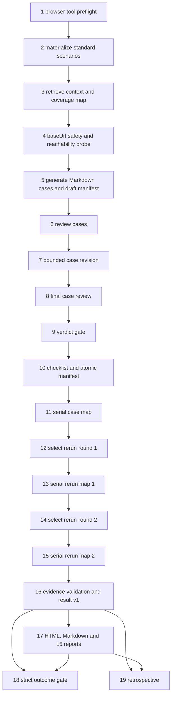

# 复杂多需求前端测试 DAG：Wave 1

状态：设计完成；managed task `2026-09-01-complex-frontend-regression-wave-1` 已创建并由 `@tea-agent/loop-agent@0.42.0-next.2` 生成、严格校验为 19 个顶层节点。当前停在 write-set review gate，尚未批准、未执行浏览器 case、无 active run。

当前冻结绑定：contract revision 2，DAG spec hash `sha256:3e1e10c30ce829f71c1f81b2f318799ac779d3b5073ea9f5d5fac767caa70756`，gate digest `sha256:f6b557081218c2f14627b7096831e2f80feebd02e45b77a8b84392c43286b68b`。任一 contract、DAG、writeSet 或 controller identity 变化都会使该 gate 失效，必须重新生成并审查。

## 1. 目标与边界

目标是用一个 `taskKind: frontend-test` DAG 覆盖 Agent 学习实验室的多个前端需求域，并把需求、用例、真实浏览器证据和最终报告串成可追溯链路。

本 Wave 覆盖：

1. 首页、课程页、未知路由的 hash 导航与页面身份。
2. 游客进度门禁、登录页结构与未登录同步禁用态。
3. 学习会话工作台的八步、模板、自评、计时和本地持久化。
4. 归档中心的空态、创建、校验、筛选、排序、编辑与清理。
5. 导出中心的字段选择、文本/JSON 序列化、下载与历史。
6. 后端不可用时的前端降级提示与本地数据保留。
7. 390px / desktop 响应式、键盘可达性、reduced-motion 和无横向溢出。
8. 归档记录进入导出预览的跨模块主流程。

不包含：修改 `src/**` 或 `server/**`、生成测试源码、生产环境测试、真实账号或凭据、跨用户数据、并行浏览器写操作、将 Mock 结果表述为真实后端集成。

## 2. 验收标准

- AC-FE-W1-001：首页、课程页与未知 hash 均显示对应唯一页面锚点，路由切换不整页重载。
- AC-FE-W1-002：390×844 与 desktop 视口都无页面级横向溢出，主导航和核心内容可访问。
- AC-FE-W1-003：游客访问进度页时看到登录门禁；工作台仍可本地使用；同步控件保持禁用。
- AC-FE-W1-004：登录页显示登录/注册表单；空值或错误提交保留表单并呈现可访问错误，不记录真实凭据。
- AC-FE-W1-005：工作台八步计数、五份模板完成度、自评分校验、计时和刷新恢复遵守本地状态契约；清理只触碰自身 key。
- AC-FE-W1-006：归档中心支持当前用例拥有的数据创建、校验、搜索、路线与状态筛选、排序、编辑和删除；用例结束恢复空态。
- AC-FE-W1-007：导出中心支持字段全选/全不选、文本与 JSON 预览、下载和历史；用例结束清理下载及本地历史证据。
- AC-FE-W1-008：归档记录可进入导出预览，标题、路线、状态、评分和备注不丢失；不污染进度与会话存储。
- AC-FE-W1-009：API 失败场景显示“服务不可用”降级提示，已存在的本地工作台/归档数据保持可用；Mock 或网络拦截必须在报告中标注。
- AC-FE-W1-010：键盘焦点、pressed/disabled 状态、可访问名称和 reduced-motion 行为可由 snapshot 与语义断言复核。
- AC-FE-W1-011：每条 manifest 用例映射至少一个本 Wave 验收 id；所有 id 至少由一个用例覆盖，无未知或截断 id。
- AC-FE-W1-012：每条通过用例都有同一 child 的成功 `open → find → cleanup` 控制器收据，以及 `execution.md`、`case-result.json` 和至少一项浏览器证据。
- AC-FE-W1-013：结果合约为 `outcome=passed`、`integrationMode=real`、0 failed、0 blocked、0 missing acceptance；否则质量门失败但仍保留主报告。

## 3. 用例分片预算

生成器最多创建 18 条 case，推荐 16 条：

| 分片 | 建议 Case ID | 维度 | 映射 |
| --- | --- | --- | --- |
| 首页 desktop 身份与导航 | `FE-W1-001-home-shell` | core | 001 |
| 首页 390px 无溢出 | `FE-W1-002-home-mobile` | boundary | 002 |
| 第一/第二课加载 | `FE-W1-003-lessons` | flow | 001 |
| 未知 hash 404 | `FE-W1-004-not-found` | boundary | 001 |
| 游客进度门禁 | `FE-W1-005-progress-guest` | core | 003 |
| 登录表单边界 | `FE-W1-006-auth-form` | boundary | 004 |
| 工作台八步与模板 | `FE-W1-007-journal-completion` | flow | 005 |
| 自评与计时恢复 | `FE-W1-008-journal-persistence` | flow | 005 |
| 工作台 key 隔离清理 | `FE-W1-009-journal-isolation` | boundary | 005 |
| 归档空态与创建校验 | `FE-W1-010-archive-create` | core | 006 |
| 归档筛选排序编辑 | `FE-W1-011-archive-manage` | flow | 006 |
| 归档删除与清理 | `FE-W1-012-archive-cleanup` | boundary | 006 |
| 导出字段与文本预览 | `FE-W1-013-export-text` | core | 007 |
| JSON 与下载证据 | `FE-W1-014-export-json-download` | flow | 007 |
| 归档到导出跨模块流 | `FE-W1-015-archive-to-export` | flow | 008 |
| API 失败降级与状态保留 | `FE-W1-016-api-fallback` | backend | 009 |
| 键盘、状态与 reduced-motion | `FE-W1-017-a11y-motion` | boundary | 010 |
| 全量验收追溯哨兵 | `FE-W1-018-traceability` | boundary | 011, 012, 013 |

case 文件名由 Case ID 决定，验收映射放在 manifest 的 `acIds`；禁止把验收 id 当 Case ID。

## 4. DAG 拓扑

配置采用 `reviewMode=blocking`、两轮有界 rerun、严格结果门和可选 retrospective，共 19 个顶层节点；动态 map 最多展开 18 个首轮 child，并只对失败、阻塞或缺证据项展开两轮候选。



关键语义：

- 节点 1 在任何 Pi 调用前检查 SDK custom-tool 能力和受信的 `@playwright/cli` 入口；缺失即零模型调用失败。
- 节点 3 只从受管 task source/config 选择一个绝对、非生产 baseUrl；节点 4 才负责可达性事实。
- 节点 5 只能写 `testcase/frontend/cases/FE-*.md`、`index.md`、`manifest.draft.json`；最终 `manifest.json` 只能由节点 10 原子物化。
- 节点 6–9 是阻塞式双审与 verdict gate；任何未知验收 id、非唯一锚点、生产 URL 或不安全数据依赖都会阻断浏览器执行。
- 节点 11 的 child 串行运行，且每条 child 的 writeSet 仅为自己的 evidence 目录。
- 节点 12–15 最多两轮，只覆盖失败、阻塞或缺结果项；最后一轮结果覆盖前一轮权威状态，但不覆盖历史收据。
- 节点 16 只从 manifest 与 case evidence 生成 hash-bound result v1；模型叙述不能伪造通过。
- 节点 17 即使存在失败/阻塞也必须生成主报告；节点 18 才执行严格全绿门。

## 5. 写入与安全边界

唯一允许写入根为 `testcase/frontend/**`：

| Owner | writeSet |
| --- | --- |
| context/package | `testcase/frontend/rag/**` |
| case generator/reviser | `testcase/frontend/cases/FE-*.md`、`index.md`、`manifest.draft.json` |
| manifest materializer | `testcase/frontend/cases/**` |
| case child | `testcase/frontend/evidence/<caseId>/**` |
| result finalizer | `testcase/frontend/evidence/**` |
| report/retrospective | `testcase/frontend/reports/**` |

`src/**`、`server/**`、`test/**`、`.harness/**`、`ai_workspace/**`、`.agents/**`、依赖与包清单全部禁止写入。U/D 用例只能创建当前用例拥有的数据；无法证明所有权或无法清理时写 `blockedReason`，不得尝试其他用户数据。

## 6. 锚点策略

生成器必须读取 [`ui-anchors.md`](../../../testcase/frontend/rag/ui-anchors.md)。只有状态为“有效”且页面/状态一致的字面可以成为通过态 `find` 断言；“不可断言”字面只能作为 blocked 证据或替代说明。

当前可用主锚点包括：

- 首页：“让 Agent 不再靠运气工作”
- 游客进度：“请先登录后再查看与保存你的学习进度。”
- 登录：“登录 · 注册”
- 归档：“学习实验归档”“还没有实验记录”
- 导出：“学习实验导出中心”“生成导出”“下载文件”“还没有导出记录”
- 第二课：“接入第一个 Tool：声明可验证的工具调用”
- 404：“页面不存在”“返回主页”

## 7. 配置与启动方式

完整 task 配置蓝图见 [`2026-09-01-complex-multi-requirement-frontend-test.task-config.json`](2026-09-01-complex-multi-requirement-frontend-test.task-config.json)。它把批次限制为 18 条 case、单 case 12k token、总计 180k token，使用 blocking review、两轮 rerun、严格结果门和 L5/retrospective 报告。

正式创建 task 时，应先把本文作为原始 PRD 交给 managed contract intake，并在 DAG 生成前通过 Console/Task Contract 应用配置蓝图；不要在 write-set gate 生成后直接编辑冻结的 `task.json`。标准入口形态：

```bash
loop-agent task advance 2026-09-01-complex-frontend-regression-wave-1 \
  "Agent 学习实验室复杂多需求前端回归 Wave 1" \
  --prd ai_workspace/loop-agent/design/2026-09-01-complex-multi-requirement-frontend-test.md \
  --task-kind frontend-test \
  --allowed-path "testcase/frontend/**" \
  --forbidden-path ".harness/**" \
  --forbidden-path "src/**" \
  --forbidden-path "server/**" \
  --verify "test:npm run test" \
  --verify "typecheck:npm run typecheck" \
  --verify "build:npm run build" \
  --profile auto \
  --max-concurrent 4 \
  --json
```

首次 `task advance` 只应推进到 write-set review gate。批准前必须核对：taskKind、19 节点拓扑、所有 writer writeSet、两个 rerun round、strict outcome gate、baseUrl 来源、浏览器 child 的 capability allowlist、UI 锚点账本注入和最终 shell verification。长跑批准由 Console operation 后台持有，不在前台 shell 直接等待。

## 8. 完成判定

以下层次分别报告，不能互相替代：

1. DAG 设计：配置和拓扑通过当前控制器校验。
2. 环境：隔离 baseUrl 可达，浏览器工具 preflight 通过。
3. Pipeline：result v1 与主 HTML/Markdown 报告生成。
4. Quality：strict outcome gate 全绿，无 failed/blocked/missing acceptance。
5. 项目基线：`npm test`、`npm run typecheck`、`npm run build` 通过。
6. 治理：run 归档后按项目验证矩阵执行裸治理检查；活动 run 期间只能使用验证矩阵登记的 active-run override。

任何 blocked case、Mock-only 后端场景、未执行的移动端视口、缺失控制器收据或未归档 DAG，都必须作为剩余风险保留，不能写成“测试完成”。
